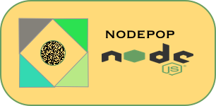
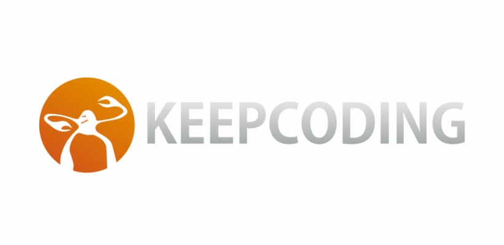

# NODEPOP
App de NodeJS-API 

### Bootcamp Web KeepCoding practica03

Una App realizada con NodeJS y Express

## Install

<code>git clone RUTA DE GIT</code>

<code>$ cd nodemon</code>

<code>$ npm i ó $npm install</code>

## Use

1. Arrancar nuestra APP

<code>$ nodemon</code>

2. Inicializar la Base de Datos

MondoDB --> descargar de la web oficial https://www.mongodb.com

<code>$ cd mongodb_versiondescargada</code>
<code> $ ./bin/mongod --dbpath ./data/db --directoryperdb</codes>

3. Usos de nuestra App

## 3.1 Arrancar nuestra base de datos

<code> $ ./bin/mongod --dbpath ./data/db --directoryperdb</codes>

## 3.2 Inicializar el script install_db

<code>$ node install_db.js</code>

## 3.3 Comprobar la app en el navegador

http://localhost:3000

## 3.4 Nuestra app y sus rutas

http://localhost:3000/apiv1

http://localhost:3000/apiv1/anuncios

## Documents

App realizada como una API de NODEJS que nos ofrece diferentes funciones en el lado del servidor.

## License

MIT

© Copyright 2018, @pedri77.

https://opensource.org/licenses/MIT

